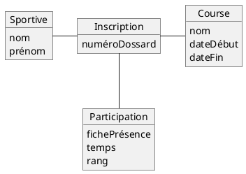
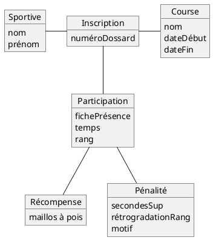

# Exercice 1.4 — Courses cyclistes

## Question 4

Le classement doit être matérialisé car le rang obtenu par une sportive
dépend de la course à laquelle elle participe. Une même sportive peut
avoir un rang différent dans différentes courses.

## Question 5

### Première version du modèle

## Question 6

Les récompenses et les pénalités ne peuvent pas être représentées
exactement de la même façon car elles n'ont pas le même rôle.

Une récompense est attribuée à une sportive, tandis qu'une pénalité
modifie son résultat ou son classement et possède un motif.

## Question 7

### Deuxième version du modèle

